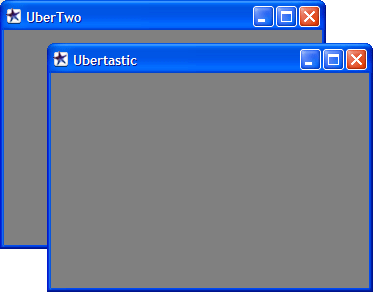
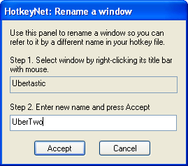

.. _8-Renaming-Windows:

8. Renaming Windows
==============================================================================
HotkeyNet identifies windows by their names. This creates a problem when you run two copies of a game on the same PC, because HotkeyNet can't tell one from the other.

To solve the problem, you must rename one or both windows so each one has a unique name, like this:

**How to rename manually**

HotkeyNet gives you four different ways of renaming windows. To do it manually, click the Rename button or select Rename on the tray menu. This brings up the Rename panel. Then right click the title bar at the top of the window you wish to rename and type the new name in HotkeyNet's Rename panel, like this:

**How to rename with hotkeys using the old name**

The second way to rename windows is with a hotkey and the old name. Here's an example:

   <hotkey ctrl R>
      <sendpc local>
         <RenameWin Ubertastic Uber1>
         <RenameWin Ubertastic Uber2>

This hotkey renames the first instance of Ubertastic to "Uber1" and the second instance to "Uber2."

If a name contains spaces, enclose it in quotation marks::

   <RenameWin "Dark Age of Camelot" "DAOC 1">

**How to rename with hotkeys using the path**

The third way to rename windows is with a hotkey and the path of the program's executable file. Here's an example::

   <hotkey ctrl R>
      <sendpc local>
         <RenameFromPath "C:\uber\uber.exe" Uber1>

You don't have to specify the entire pathname of the executable file. For example, you could type just the directory::

   <RenameFromPath "C:\uber\" Uber1>

If the path or new name contains spaces, enclose it in quotation marks. I've used quotation marks in these examples to remind you even though they aren't necessary here.

Note to World of Warcraft players: WoW does not allow itself to be renamed with RenameFromPath. You'll have to use the other two methods.

**How to rename with RenameTargetWin**

The fourth way is a hotkey that uses RenameTargetWin. This is similar to RenameWin, described above, but sometimes it's more convenient. See the reference section for details.
