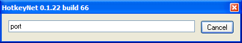
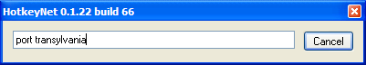
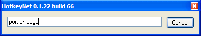

.. _14-user-defined-commands:

14. User-defined Commands
==============================================================================
HotkeyNet lets you make commands which are even more powerful than hotkeys. Here's how they work.

Suppose you play a game where your characters say "Port Transylvania" to go to Transylvania. And suppose they travel regularly not only to Transylvania, but dozens of other places as well.

You could automate your travel by making dozens of hotkeys, one for each destination. But that's a lot of work and it would be hard to remember which key leads to which place.

Commands offer another way to handle this. You hit a key that pops up a little window with the word "port" in it:

You type the destination:

You press Enter, and all your characters say "port transylvania." The reason this is better than a hotkey is that you can type any destination you like. For example you could type this:

And your characters will go to Chicago instead.

In order to make the command window work this way, you need to do two things in your hotkey file:

    1. Define what the command "port" does.
    2. Define a hotkey that causes the little window to appear with the word "port" in it.

Here's how you write the first item.. (I'll include just one game window in this example to keep it short.)::

    <Command port>
    <SendPC local>
    <SendWin MyGame1>
    <Text /Say port %ALL%><Key enter>

The red symbol is called a macro. When HotkeyNet executes this command, it replaces the macro with everything you typed after "port" on the command line. (If you want to substitute individual words instead of everything you typed, use %1%, %2%, %3%, etc. instead of %ALL%.)

The second thing you need to define is a hotkey that opens the command line window. In this example we'll make the window open with the word "port" already typed in it, but this is optional. Here's how you write this second item::

    <Hotkey Ctrl P>
    <SendPC local>
    <CommandLine port>

That's all you have to do. It took just seven lines of code.

**Not only that…**

User-defined commands can be used as subroutines by including them inside other commands or hotkey definitions. For more information, go here.

**ThirdPartyCommandLine**

I used the command line window in this example because it makes things easy to explain. But you can use commands without it. If you prefer, you can enter your commands on the chat line of a game or in any text-entry field in any program. For details, see ThirdPartyCommandLine.

**Related topics**

Command
Subroutines
CommandLine
ThirdPartyCommandLine